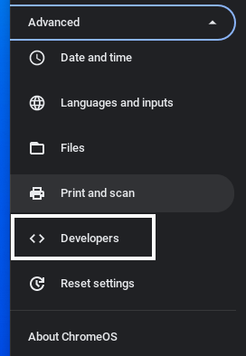
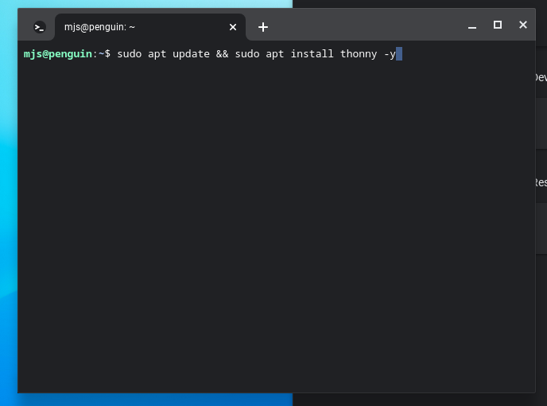

## Install Thonny on a Chromebook

Open the application menu and select or search for the **Settings** application.

From the settings menu, select **Advanced**

Select the **Developers** option.

Click **Turn on** for the Linux development environment.

Click **Next**

You need to choose a username for your Linux account then click **Install**

Once Linux has been installed, you can access it in the application menu.

Click on the hostname for your Linux install. Here it is called **penguin**

Install Thonny using the following command.

--- code ---
---
language: bash
filename: 
line_numbers: 
line_number_start: 
highlight_lines: 
---
sudo apt update && sudo apt install thonny -y
--- /code ---

Once Thonny is installed, it should be available in the Application menu.

Thonny can now be used as normal.

